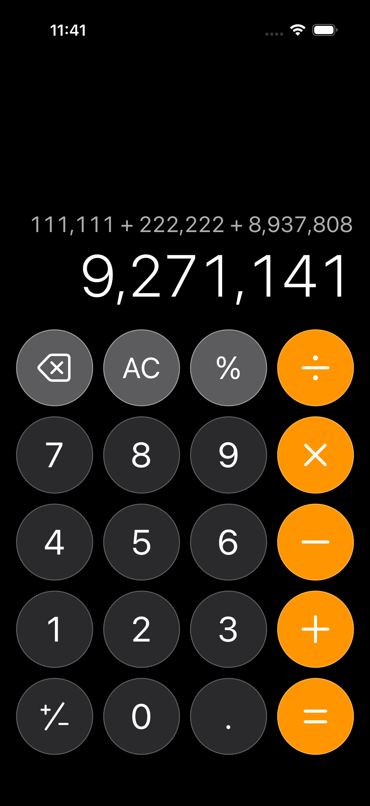

# MagicCalc

MagicCalc looks like a normal calculator, but it is made for a party magic trick.

## What It Does

The app helps a magician lead a group through a calculator trick. Everyone uses their own calculator. At the end, the answer matches the current date and time.

## How To Perform

1. Pick two people from the group
2. Press `AC` several times to clear the calculator
3. Ask the first person for any 6 digit number
4. Type it in MagicCalc
5. Say the number out loud so everyone can type it too
6. Have everyone press `+`
7. Ask the second person for any 6 digit number
8. Type it in MagicCalc
9. Say the number out loud so everyone can type it too
10. Have everyone press `+` again
11. Turn the phone face down
12. Ask the first person to tap 7 buttons without looking
13. Turn the phone back over
14. Say the new number out loud
15. Have everyone type that number and press `=`
16. The final answer will match the date and time

## Tips

- Practice before showing people
- Move slowly and speak clearly
- Make sure everyone presses the same buttons
- Keep the phone face down during the 7 blind taps
- After the 7 taps, press `=` to finish
